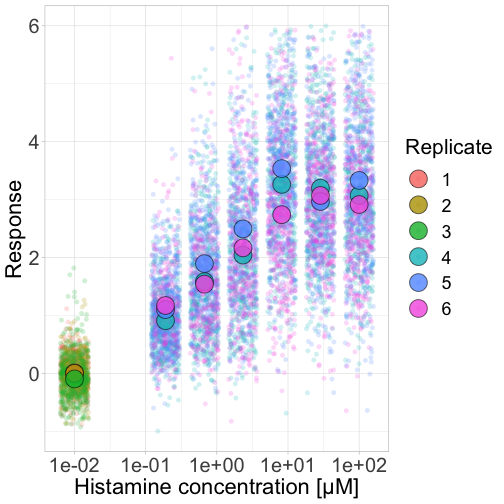
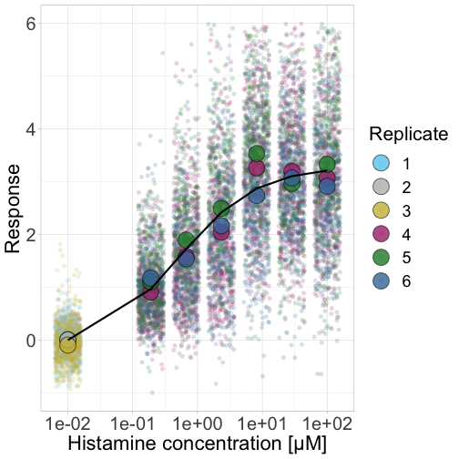
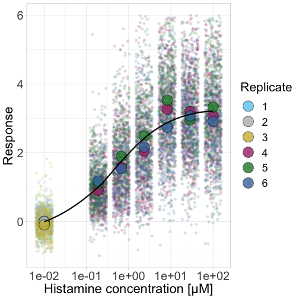
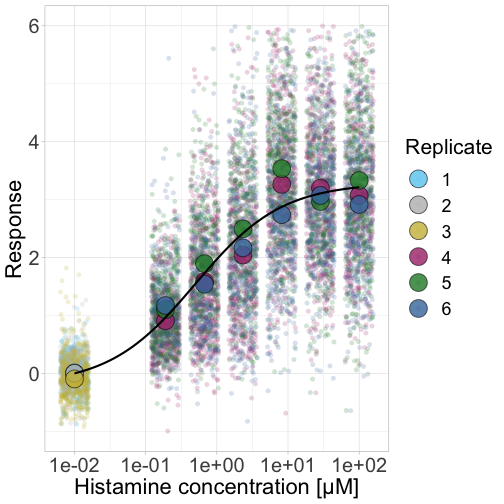

## Load packages and functions ----


```r
library(tidyverse)
```

In this protocol we visualize the data that was used to make a 'concentration reponse curve'. The data consists of some response that is a measured at different concentrations. It is usually a wide range of concentration, spanning a few orders of magnitude and often a log scale is used.
The purpose is to measure the sensitivity of the response to the concentration. One of the relevant parameters is the 'Half maximal effective concentration' abbreviated as EC50. In this protocol we use data acquired from single cells from different biological replicates. We generate a 'superplot' to distuinguish technical and sample replicates
Read the data:


```r
df_DRC <- read.csv("DRC_Histamine.csv")
```

Set 0 values to a 'low' value of 0.02, since we cannot plot 0 on a log10 scale that is used for the x-axis


```r
df_DRC <- df_DRC %>% rename(Concentration=Concen) %>%
  mutate(Concentration = ifelse((Concentration == 0),
                         yes = 0.01,
                         no = Concentration)
  )
```

Add a number for each replicate, based on the name of the 'Experiment' factor


```r
df_DRC <- df_DRC %>% mutate(Replicate=as.factor(as.numeric(Experiment)))
```

 group by 'Experiment' and concentration to get the mean per biological replicate.


```r
df_summary <- df_DRC %>% group_by(Concentration, Replicate) %>% summarise(mean_ERK=mean(ERKnac), mean_Akt=mean(Aktnac))
```

```
## `summarise()` has grouped output by 'Concentration'. You can override using the `.groups` argument.
```

Definethe plot of the response as a function of the concentration on the x-axis


```r
p <-  ggplot(data = df_DRC, aes(x = Concentration, y = ERKnac)) + 
  geom_jitter(aes(x = Concentration, y = ERKnac, color=Replicate), width=0.2, size=2, shape=16, alpha=0.2) + 
  geom_point(data=df_summary, aes(x = Concentration, y = mean_ERK, fill=Replicate), size=8, shape=21, alpha=0.8) +
  scale_x_log10()+ylim(-1,6) +
  theme_light() + ylab("Response") + xlab("Histamine concentration [µM]")+
  theme(
        axis.text = element_text(size=20),
        axis.title = element_text(size=22),
        legend.key.size = unit(1.8,"line"),
        legend.title = element_text(size = 21),
        legend.text = element_text(size = 18)
        )
```

Plot the data as superplot:


```r
p
```

```
## Warning: Removed 121 rows containing missing values (geom_point).
```



To label the different replicates with a colorblind friendly palette, we define a set of colors that were proposed by Paul Tol: https://personal.sron.nl/~pault/
Tol_bright <- c('66CCEE', '#BBBBBB', '#CCBB44','#AA3377','#228833', '#4477AA')
Try these  colors:


```r
p <- p + scale_fill_manual(values = Tol_bright) + scale_color_manual(values = Tol_bright)
```

To fit the data with nls:


```r
fit <- nls(mean_ERK ~ top+(bot-top)/(1+(Concentration/EC50)^slope),
           data = df_summary,
           start=list(bot=-2, top=8, EC50=1, slope=1))
```

To plot the fitted data, we use `augment()` function that is part of the `broom` package:


```r
library(broom)

p + geom_line(data = augment(fit), aes(x=Concentration,y=.fitted), color="black", size=1) + scale_x_log10()
```

```
## Scale for 'x' is already present. Adding another scale for 'x', which will replace the existing scale.
```

```
## Warning: Removed 121 rows containing missing values (geom_point).
```



```r
coef(fit)
```

```
##        bot        top       EC50      slope 
## -0.1990749  3.2915666  0.4968077  0.7141987
```

```r
paste(c("Min:", "Max:", "EC50:", "Slope:"),round(coef(fit), 1))
```

```
## [1] "Min: -0.2"  "Max: 3.3"   "EC50: 0.5"  "Slope: 0.7"
```

```r
p + geom_smooth(data = augment(fit), aes(x=Concentration,y=.fitted), color="black", size=1) + scale_x_log10()
```

```
## Scale for 'x' is already present. Adding another scale for 'x', which will replace the existing scale.
```

```
## `geom_smooth()` using method = 'loess' and formula 'y ~ x'
```

```
## Warning: Removed 121 rows containing missing values (geom_point).
```




# An alternative is provided by the `drc` package.
 https://stackoverflow.com/questions/36780357/plotting-dose-response-curves-with-ggplot2-and-drc/37043751
 to get a SINGLE CURVE with average of average Experiment:


```r
library(drc)
```

```
## Loading required package: MASS
```

```
## 
## Attaching package: 'MASS'
```

```
## The following object is masked from 'package:dplyr':
## 
##     select
```

```
## 
## 'drc' has been loaded.
```

```
## Please cite R and 'drc' if used for a publication,
```

```
## for references type 'citation()' and 'citation('drc')'.
```

```
## 
## Attaching package: 'drc'
```

```
## The following objects are masked from 'package:stats':
## 
##     gaussian, getInitial
```

```r
p + geom_smooth(data=df_summary, aes(x = Concentration, y = mean_ERK),color='black', method = drm, method.args = list(fct = L.4()), se = FALSE)
```

```
## `geom_smooth()` using formula 'y ~ x'
```

```
## Warning: Removed 121 rows containing missing values (geom_point).
```



We have used the `drc` package to fit the data in the original paper, but I like the control that I have with the method that uses `nls()`.
