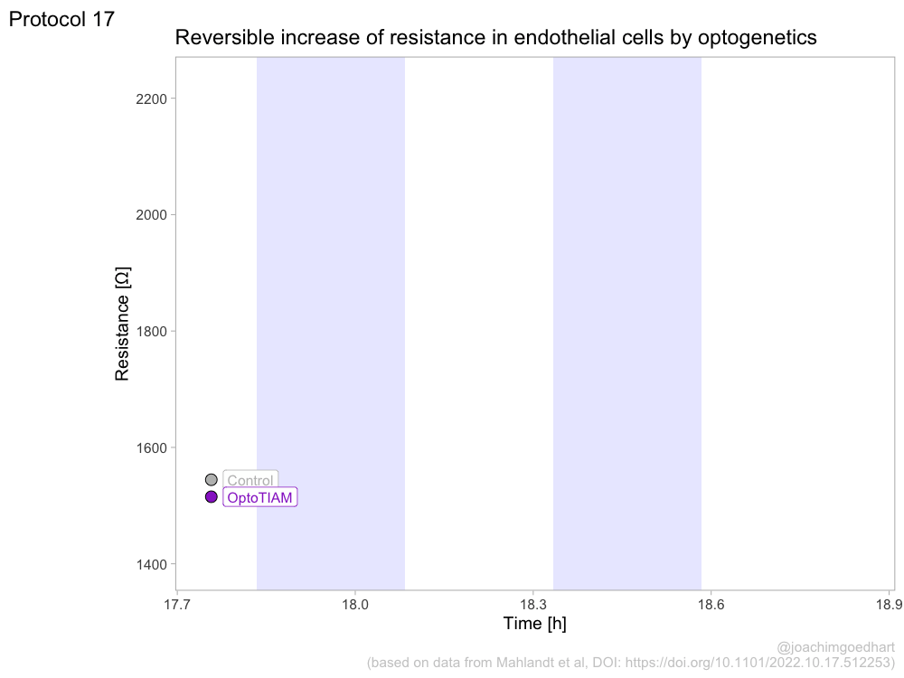

## Protocol 17 - Animated plots of data from optogenetics experiments {#protocol-17}

To study dynamic processes, data is measured at multiple points in time. This type of data is often presented in lineplots (see for instance protocols 3 & 7). To better visualize the dynamics, animated versions of lineplots can be made. These are nice for presentations or websites. This protocol explains how to generate an animated lineplot from timeseries data. The data is originally published by [Mahlandt et al (2022)](https://www.biorxiv.org/content/10.1101/2022.10.17.512253v1).

Load the required packages:

```{r}
library(tidyverse)
library(gganimate)

```

First, we load the data from an excel file:

```{r}
df <- readxl::read_excel('data/210222_OptoG08_02_Sheldon_TIAM_tidy_02.xlsx')
head(df)
```
The entire dataset is quite large and to simplify the presentation, we select a timerange between 17.75 and 18.8378 (this is the time in hours). In this timerange the dynamics can be nicely observed:

```{r}
df_sub <- df %>% filter(Time >= 17.75 & Time <= 18.8378)
```

There are two factors in the column 'type', namely Control and OptoTiam. We calculate the summary of the measurements and labele the new column 'Value':

```{r}
df_sub_summary <- df_sub %>% group_by(type, Time) %>% summarize(mean=mean(Value))
```

Let's make a first plot to visualize the data:

```{r}
ggplot(df_sub_summary, aes(x=Time, y=mean, color = type)) + geom_line(linewidth=2) 
```

This looks good, so let's define an object that contains the plot:


```{r}
p <- ggplot(df_sub_summary, aes(x=Time, y=mean, color = type)) + geom_line(linewidth=2) + geom_point(aes(fill=type), color="black", size=4, shape=21)
```

Note that we add a dot as well, by 'geom_point()'. This will looks messy in the static plot, but it is a nice addition for the dynamic plot.

```{r}
p <- p + theme_light(base_size=14) +
  theme(panel.grid = element_blank()) +
  theme(legend.position="none")

p
```

In this experiment, cells are exposed to blue light (optogenetics) and this triggers a change in the measured value. So below, we define two lightblue rectangles that indicate the illumination with blue light:

```{r}
p <- p + annotate("rect", xmin = 17.8333, xmax = 18.0833 , ymin = -Inf, ymax = Inf, fill="blue", alpha=0.1) +
   annotate("rect", xmin = 18.3333, xmax = 18.5833 , ymin = -Inf, ymax = Inf, fill="blue", alpha=0.1)
p
```

Now, we change the colors of the two lines and dots:

```{r}
p <- p + scale_color_manual(values = c("#BEBEBE", "darkorchid")) +
  scale_fill_manual(values = c("#BEBEBE", "darkorchid"))
p
```

Next, we can add labels and titles:
```{r}
p <-
  p + labs(
    title = "Reversible increase of resistance in endothelial cells by optogenetics",
    x = "Time [h]",
    y = "Resistance [Ω]",
    caption = "@joachimgoedhart\n(based on data from Mahlandt et al, DOI: https://doi.org/10.1101/2022.10.17.512253)",
    tag = "Protocol 17"
  ) + theme(plot.caption = element_text(color='grey80', hjust=1))
```

This is the version that I save as a preview of the animation:

```{r}
png(file=paste0("Protocol_17.png"), width = 4000, height = 3000, units = "px", res = 400)
 p
dev.off()
```

For the animated version, we can add a label for each of the two conditions. Note that (similar to the dots) it is plotted for each datapoint. But, in the animated version, only the leading (newly drawn) datapoint and label is shown.

```{r}
p <- p + geom_label(aes(x = Time, y=mean, label=type), nudge_x = 0.02, size=4, hjust=0)
```

Finally, we can turn this into an animated object with the function `transition_reveal()` from the `{gganimate}` package:

```{r}
a <- p + transition_reveal(Time)
```

To generate an animated plot, we used `animate()` and define the number of frames:

```{r, results="hide"}
animated_plot <- animate(a, nframes=100, width = 1000, height = 750, units = "px", res = 100)
```

The result can be displayed by typing `animated_plot` in the command line:



To save the animated object `a` to disk, use:

```{r, results="hide"}
animate(a, 70, renderer = gifski_renderer("Protocol_17.gif"), width = 1000, height = 750, units = "px", res = 100)
```


